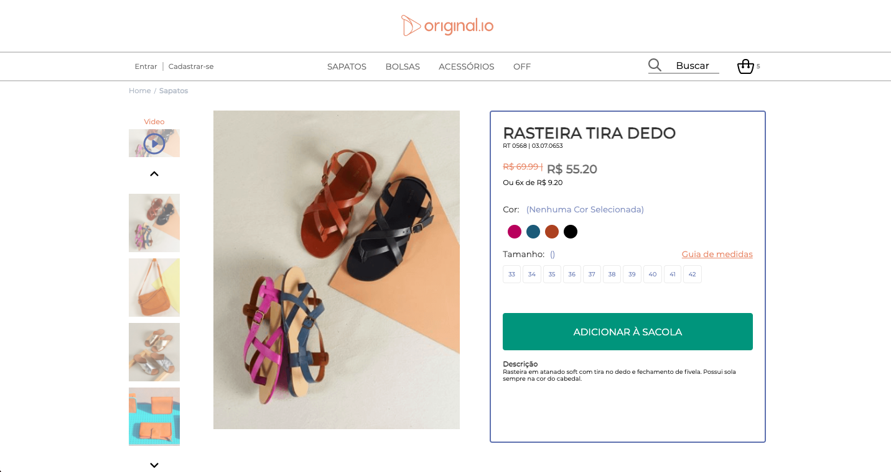
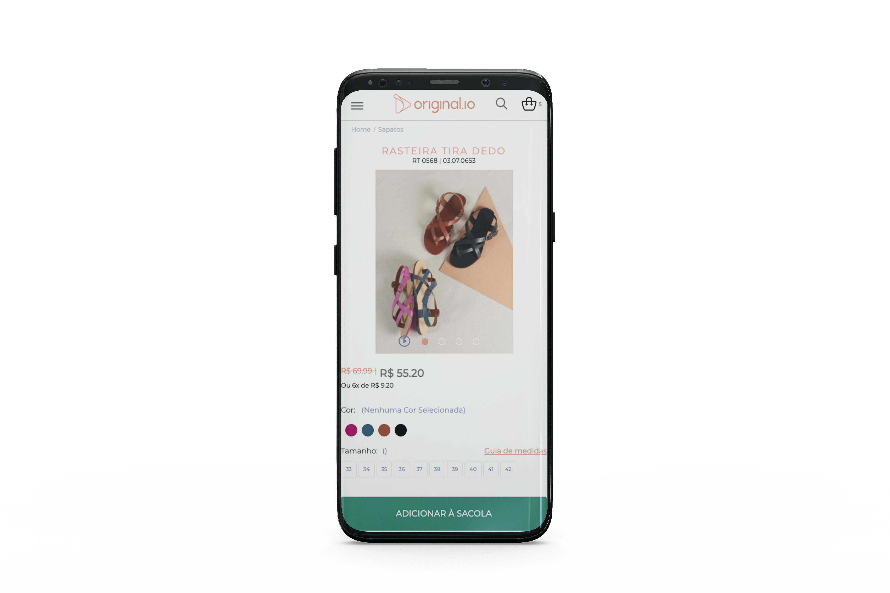
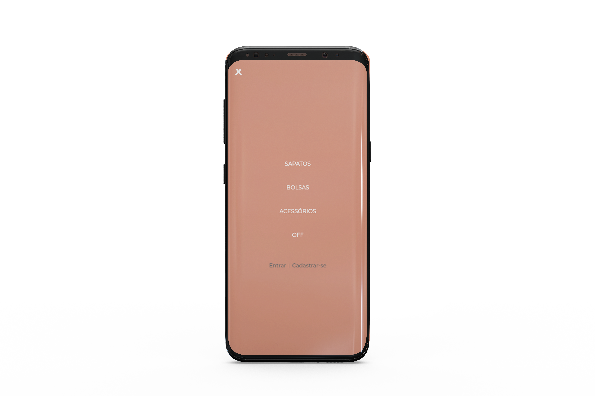

<h1 align="center">
    
</h1>

<h4 align="center"> 
 ⚡️ Original.io ⚡️ Concluido...
</h4>

## 💻 Sobre o projeto

⚡️ Original.io - Projeto teste, criação do layout, desafio.

Projeto desenvolvido com Reactjs com API hospedada na Heroku.
Ótimo desafio e aprendizado..

## 🎨 Layout

O layout da aplicação está disponível no Figma:

<a href="https://www.figma.com/file/MOlhG4R9BQMlNjiFRG8Keo/Original.io-frontend-test?node-id=0%3A1">
  
</a>

### Mobile

<p align="center">
  

  
</p>

### Web

<p align="center" style="display: flex; align-items: flex-start; justify-content: center;">
  
</p>

## 🛠 Tecnologias

As seguintes ferramentas foram usadas na construção do projeto:

- [React][reactjs]
- [Node.js][nodejs]

## 🚀 Como executar o projeto

Podemos considerar este projeto como sendo divido em duas partes:

1. Back End (https://github.com/CristianoBV/api_rest_original.io)
2. Front End (https://github.com/CristianoBV/project_original.io)

💡Front End precisam que o Back End esteja sendo executado para funcionar.

### Pré-requisitos

Antes de começar, você vai precisar ter instalado em sua máquina as seguintes ferramentas:
[Git](https://git-scm.com), [Node.js][nodejs].
Além disto é bom ter um editor para trabalhar com o código como [VSCode][vscode]

### 🧭 Rodando a aplicação web (Front End)

```bash
# Clone este repositório
$ git clone https://github.com/CristianoBV/project_original.io

# Acesse a pasta do projeto no terminal/cmd
$ cd nlw1

# Vá para a pasta server
$ cd server

# Instale as dependências
$ yarn install

# Execute a aplicação em modo de desenvolvimento
$ yarn dev:server

# O servidor inciará na porta:3000 - acesse http://localhost:3000
```

### 🎲 Rodando o Back End (servidor)

```bash
# Clone este repositório
$ https://github.com/CristianoBV/api_rest_original.io

# Acesse a pasta do projeto no seu terminal/cmd
$ cd nlw1

# Vá para a pasta da aplicação Front End
$ cd server

# Instale as dependências
$ yarn install

# Execute a aplicação em modo de desenvolvimento
$ yarn start

# A aplicação será aberta na porta:3000 - acesse http://localhost:3333
# Necessário hospedar na Heroku
```

## 📝 Licença

Este projeto esta sobe a licença.

Feito com ❤️ por cristiano Borges 👋🏽 [Entre em contato!](https://www.linkedin.com/in/cristianobv/)

[nodejs]: https://nodejs.org/
[reactjs]: https://reactjs.org
[yarn]: https://yarnpkg.com/
[vscode]: https://code.visualstudio.com/
[vceditconfig]: https://marketplace.visualstudio.com/items?itemName=EditorConfig.EditorConfig
[license]: https://github.com/CristianoBV/privacy_policy
[vceslint]: https://marketplace.visualstudio.com/items?itemName=dbaeumer.vscode-eslint
